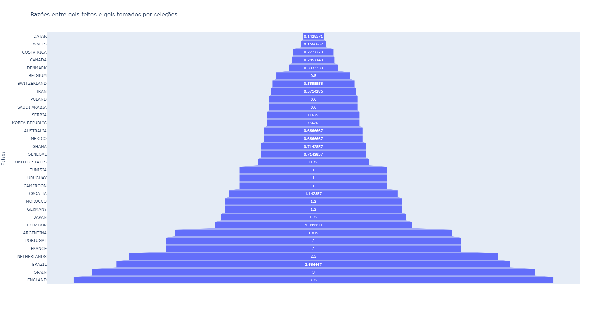

# Fifa World Cup Dataset

> Trabalho final da disciplina Algoritmos e Programação de Computadores do semestre 2022/2

Gráficos com a razão entre gols feitos e gols tomados pelas seleções participantes da copa do mundo de 2022, dados retirados de um <a href="https://www.kaggle.com/datasets/die9origephit/fifa-world-cup-2022-complete-dataset">dataset do kaggle</a>. O intuito do trabalho era treinar conhecimentos de Python, não da biblioteca Pandas, logo, poucos recursos dessa biblioteca foram utilizados.

Arquivos diferentes foram criados para os dados contendo seleções e seus grupos, funções utilizadas nas iterações e para a criação do gráfico. O gráfico e o dashboard foram feitos por meio de bibliotecas do Plotly.

